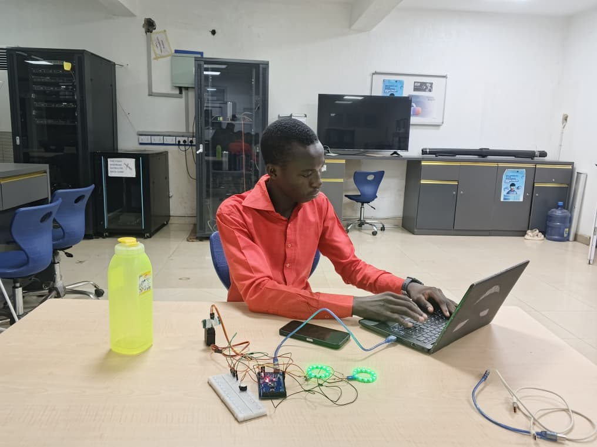

# Smart Radar Surveillance System

A real-time embedded radar monitoring system developed using the Arduino Mega 2560, ultrasonic sensor scanning, WS2812 LED indicators, buzzer alarm system, servo motor rotation, and Processing visualization.

The project simulates a radar-like detection system capable of scanning its surroundings, detecting nearby objects, and triggering visual and audio alerts.

---

# Features

- Real-time object detection
- Servo motor radar scanning
- Distance measurement using ultrasonic sensing
- WS2812 LED visual indicators
- Buzzer alarm for close-range detection
- Serial communication with Processing
- Radar-style visualization interface

---

# Components Used

## Hardware

1. Arduino Mega 2560
2. Ultrasonic Sensor (HC-SR04)
3. Servo Motor (S930)
4. WS2812 LED Ring
5. Buzzer Alarm
6. Jumper Wires
7. Breadboard
8. USB Cable

---

# Software Used

- Arduino IDE
- Processing IDE
- FastLED Library
- Servo Library

---

# How the System Works

The servo motor continuously rotates between 15° and 165°.

At every angle:
- The ultrasonic sensor measures the distance to nearby objects.
- The Arduino sends the angle and distance data through serial communication.
- The Processing application receives and visualizes the data in a radar-style interface.

## Alert Logic

### Object Detected Within 20 cm
- WS2812 LEDs turn RED
- Buzzer alarm activates

### No Close Object Detected
- WS2812 LEDs turn GREEN
- Buzzer remains OFF

---
## Project Images

[Click here for other images](images)

## Project Codes

[Click Here for the Arduino Code](arduino_code/RADAR_SCANNING_SURVEILLANCE_SYSTEM_processing.ino)

[Click Here for the Processing Code](Processing_code/MAKERS_1_PDE.pde)

## Project Demonstration

[Click here to check out the project Demo Video](https://youtu.be/pRkvvYLPDWA)
